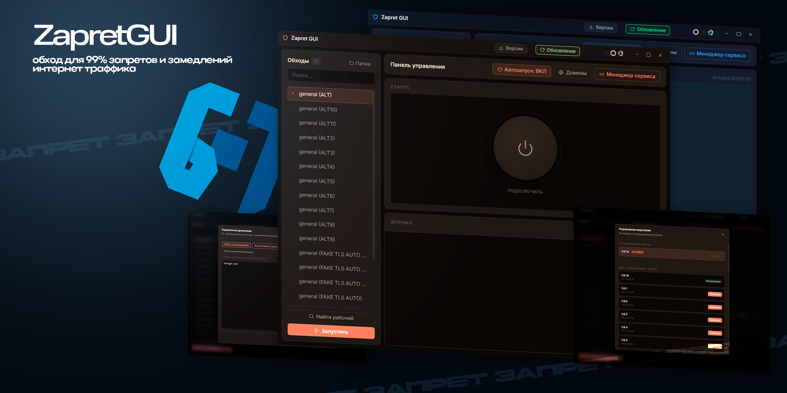

# 🚀 ZAPRET GUI REMAKE

  

Удобный графический интерфейс для настройки обхода блокировок.

## 📸 Скриншоты

## 📥 Скачать
Нажмите на ссылку ниже, чтобы скачать последнюю версию установщика:

### [👉 СКАЧАТЬ ZAPRET GUI (Windows)](https://github.com/murzikovv/zapret-gui-remake/releases/latest/download/ZapretGUISetup.exe)

---

## ❓ Часто задаваемые вопросы (FAQ)

**В: Антивирус/SmartScreen ругается на файл, что делать?**
О: Это нормально для самописных программ без дорогой цифровой подписи. Просто нажмите "Подробнее" -> "Выполнить в любом случае". Весь код открыт — вы можете проверить его сами.

**В: Программа не видит стратегии, что делать?**
О: Убедитесь, что вы распаковали все файлы из архива или корректно установили программу через инсталлер.

**В: Перестало работать видео, что делать?**
О: Попробуйте сменить стратегию в выпадающем списке и нажать "Подключить" заново.

---

## ✨ Особенности
- **Авто-обновления**: Программа сама предложит обновиться, когда выйдет новая версия.
- **Аналитика**: Вы всегда в сети, пока запущен обход.
- **Простой интерфейс**: Минимум настроек — максимум результата.

## 🛠 Установка
1. Скачайте файл `ZapretGUISetup.exe`.
2. Запустите его и следуйте инструкциям установщика.
3. После установки запустите программу с рабочего стола.
4. Выберите нужную стратегию и нажмите кнопку **ПОДКЛЮЧИТЬ**.

---
*Разработано murzikovv*
